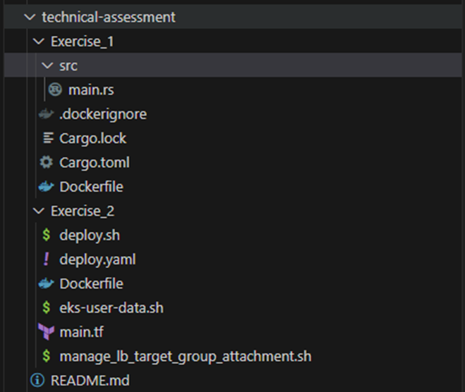

# technical-assessment

Exercise 1 Solution

Original Dockerfile:

 I optimized the provided Dockerfile by improving its efficiency, security, and reducing its size through several key enhancements:

•	Multi-stage build 
    o	Separated the build environment from the runtime environment.
    o	One stage for building with a smaller Rust image that already has the necessary tools, avoiding the need to download dependencies.
    o	One stage for runtime, using a lightweight Debian image.
    o	This reduces the final image size by only including the compiled binary in the runtime image.
•	Security Improvements:
    o	I created a non-root user in the runtime stage to run the application, avoiding root access. The application binary ownership is changed to this user.
•	Minimal final image: Only the compiled binary is copied into the runtime image 
•	Efficient use of pre-built Rust tools to eliminate the need for downloading dependencies
•	Smaller base images for a more efficient and lightweight Docker build

Exercise 2 Solution
Current Infrastructure:
•	VPC with two public subnets across different availability zones 
•	EC2 instances running the applications 
•	Elastic Load Balancer for traffic distribution 
•	Security Group allowing HTTP traffic 
•	Simple deployment using user data script on EC2 instances

Proposed Improved Infrastructure
The aim of this improvement is to modernize the infrastructure while ensuring high availability, security, scalability, and cost-efficiency. Below are the enhancements made:
•	Kubernetes
    o	The application is deployed on an EKS cluster, this provides a scalable, highly available environment.
    o	The EKS cluster is deployed across multiple private subnets in three availability zones to ensure high availability and fault tolerance
    o	EKS worker nodes are part of an auto-scaling group within the private subnets to ensure resource availability and optimal cost management.
•	VPC and Subnets:
    o	The VPC has been expanded to include three public subnets and three private subnets across three availability zones, ensuring redundancy.
    o	NAT Gateways are deployed in each public subnet to allow worker nodes in the private subnets to make outbound requests.
•	Application Load Balancer:
    o	The ELB has been replaced with an Application Load Balancer, which has improved routing, security and performance.
    o	The ALB is configured to distribute traffic across EKS worker nodes and perform health checks to ensure that traffic is only routed to healthy instances.
•	Security:
    o	Created separate security groups for the ALB and the EKS worker nodes.
•	High Availability:
    o	I have deployed the NAT Gateway in all public subnets to ensure that private subnets remain operational even if an availability zone suffers an outage.
    o	The private subnets are associated with their own route table that directs outbound traffic to the appropriate NAT gateway.
•	Cost Efficiency:
    o	I have added auto-scaling groups, so the architecture can scale automatically based on demand, reducing costs when the load is low.

Assumptions:
•	The traffic load is expected to grow over time, requiring a scalable infrastructure.
•	For this exercise/demo purpose, the application uses HTTP traffic, in a development/ production environment, we can add AWS ACM certificates to the load balancers for HTTPS traffic.
•	The architecture needs to be highly available, across multiple AZ’s.
•	The application is deployed as a type Deployment, if the application requires to be Stateful, we can change the type to Stateful Set and add a Persistent Volume Claim to the stateful Set.
•	I have assumed the application will be deployed in EU-WEST-2 region.

Enhancements:
•	You can integrate a CI/CD pipeline for automated integration and deployments.
•	You can integrate Logging & Monitoring using AWS CloudWatch/Prometheus/Grafana/

AWS Architecture Diagram:

Terraform Plan Diagram: 
 

How to run 

Access Public GitHub Repository
I have uploaded the code to this GitHub repository:
https://github.com/florin721/technical-assessment.git

Clone the following repository and open it in your preferred code editor:

 
Access Public Docker Hub Registry:
For exercise 1, we have built the docker image using the dockerfile inside the GitHub repository, it contains the rust hello world application. Docker image:
https://hub.docker.com/repository/docker/florin721/rust_sample_app/general

For exercise 2, I have built a docker image which contains all the tools needed to run the deploy.sh file and create the infrastructure on your AWS account. Docker image:
https://hub.docker.com/repository/docker/florin721/terraform-aws-k8s-env/general

Running deploy.sh 

Using the exercise 2 docker image, create a docker container:
docker run -it florin721/terraform-aws-k8s-env
If the image is not present locally, it will pull it from the docker hub public registry:

 

!!!!!!!!!!!!!!!!!!!!!!!!!!!!!                            IMPORTANT                                   !!!!!!!!!!!!!!!!!!!!!!!!!!!!!
Once you are inside the container, you will need to run the following command to configure access to AWS: 
aws configure

 
NOTE: The Key ID and Access key above are for example purposes, they are not active anymore. Please create your own Access Key ID and Secret access key by creating a AWS IAM User.

!!!!!!!!!!!!!!!!!!!!!!!!!!!!!                            IMPORTANT                                   !!!!!!!!!!!!!!!!!!!!!!!!!!!!!
Please make sure you have run the aws configure command before proceeding forwards.

Once AWS is configured, you can run the deploy.sh file: 

 
This will build all the infrastructure in main.tf, then deploy the application and service from deploy.yaml.

The ./deploy.sh command will run for about 10-15 minutes

Do not stop the script until you see the following message:  

Once you can see “Deployment complete! Your app should now be available on the EKS cluster” , means that all the infrastructure has been deployed , and the service and applications are deployed on the EKS cluster too.

To confirm this , run the following commands inside the docker image:
kubectl get pods -n opendelta
kubectl get svc -n opendelta
You should see the following:

 

Now please Navigate to your AWS Management Console, and select Region EU-WEST-2:
 

Now please Navigate to EC2:  

And go to Load Balancers section:

 You should be able to see an Application Load Balancer named k8s-load-balancer, please copy the DNS name.

Once you have copied the DNS name, enter it in your browser:  

After giving 5 minutes to the target groups to register, you can follow the ALB DNS in your browser ,  you will be able to see the Hello World application with a 200 response:

 

If you are not able to see the above, please monitor the target group attached to the ALB:

 

Please Ensure All registered targets have a Healthy status:  

If they do not have a Healthy Status, please consider Degistering them and registering them as targets again on port 30080.

If you have any issue running this exercise please contact me.

